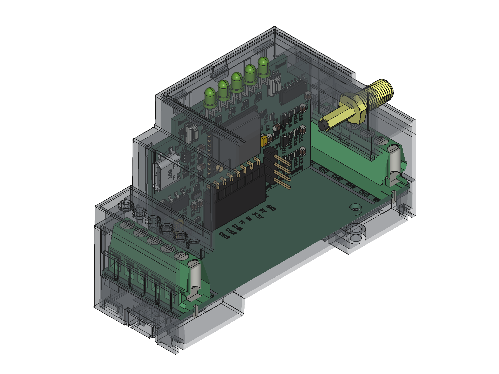
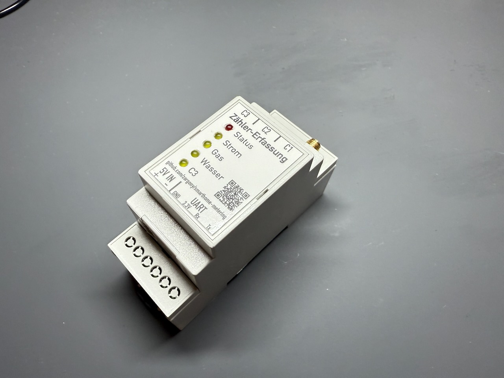
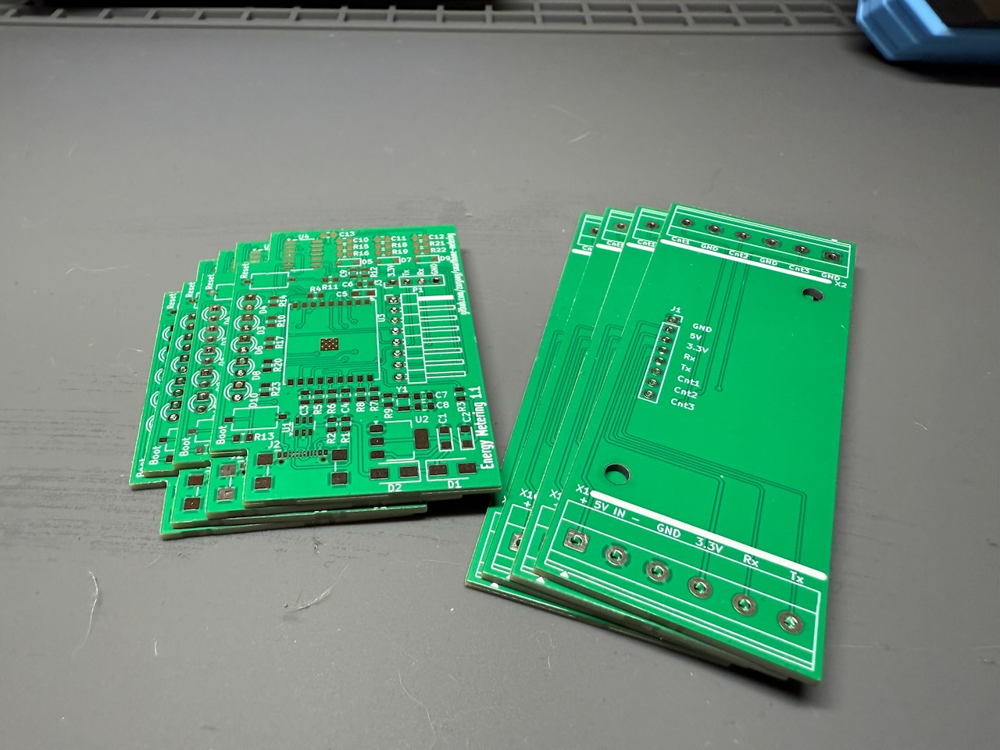
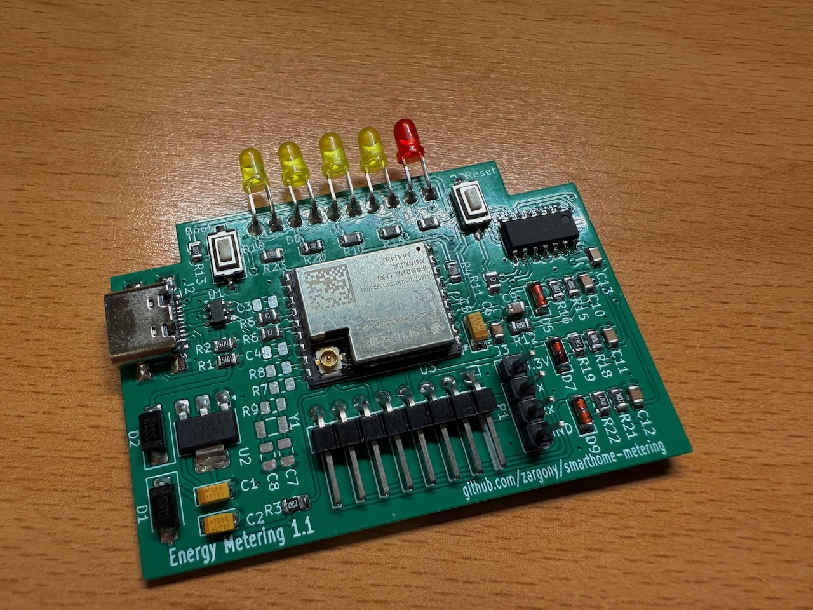
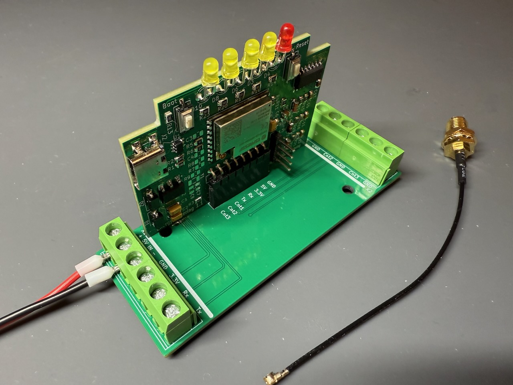
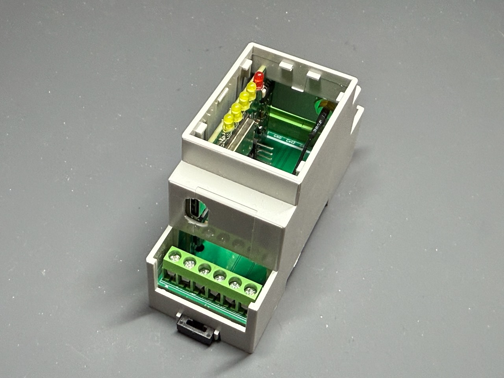
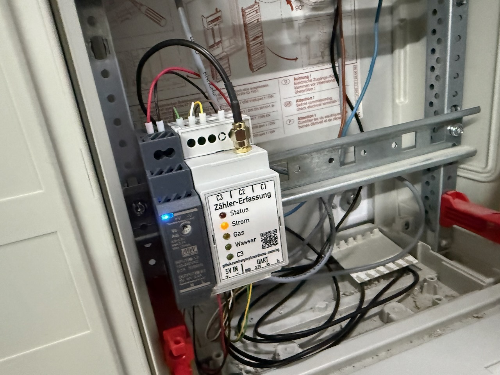
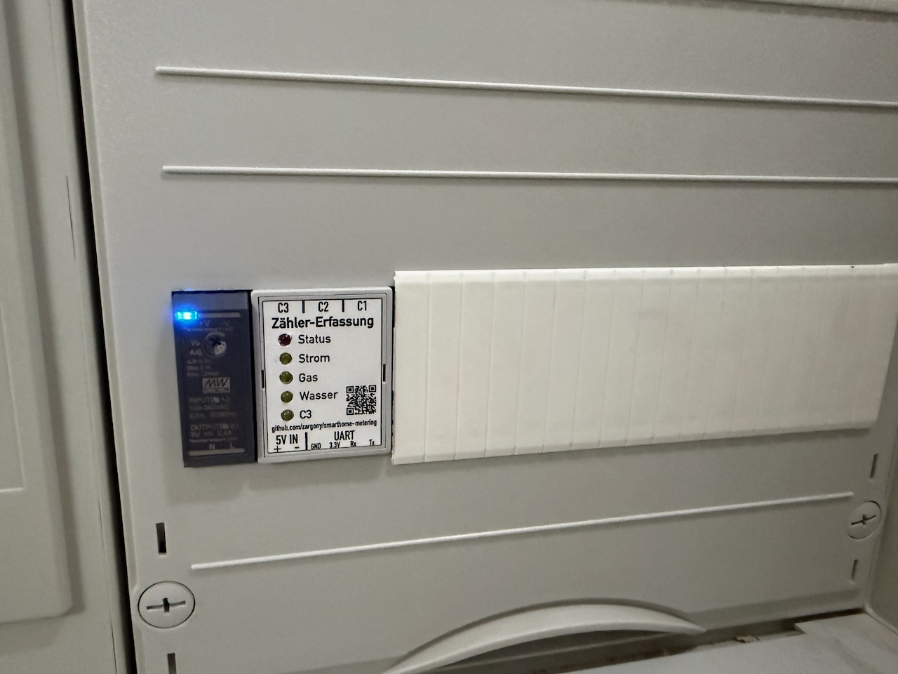
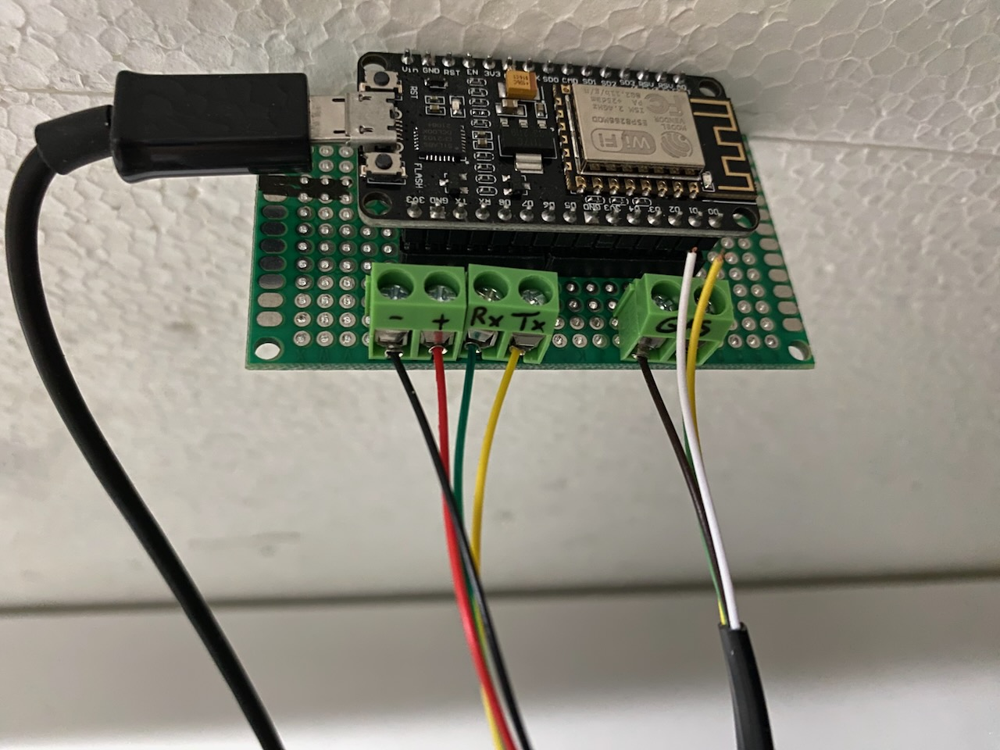

# Smart Home Energy Metering

A device for capturing energy consumption at home by reading energy meters.

This device, built around the ESP32-C3, collects data from electricity, gas, and water meters and publishes it via MQTT for integration with databases and long-term analysis. Housed in a DIN rail enclosure, it fits seamlessly into a standard European meter cabinet.

 

## Hardware

The standard [DIN rail enclosure] can be mounted onto a DIN rail and only shows status and activity LEDs when installed in a meter cabinet. [Power supply] and sensor connections are exposed via screw terminals. An external antenna can be connected to the SMA socket and is best mounted outside the cabinet for good Wifi connection. An USB-C socket exposes the ESP32-C3 Serial/JTAG port for easy programming/debugging (e.g. if OTA failed).

     

### Sensor connections

This device provides a 3.3V bidirectional UART for reading a serial data stream, e.g. an electric meter's infrared interface. Additionally 3 debounced impulse contacts can be used to capture simple count impulses, e.g. from reed contacts on water and gas meters (or electric meters without IR interface but impulse LEDs).

| GPIO  | Direction                 | Usage                      |
|-------|---------------------------|----------------------------|
| GPIO3 | Input, Pull-Up, Debounced | Contact 1 (gas meter)      |
| GPIO4 | Input, Pull-Up, Debounced | Contact 2 (water meter)    |
| GPIO5 | Input, Pull-Up, Debounced | Contact 3                  |
| GPIO6 | Input                     | UART Rx (electrical meter) |
| GPIO7 | Output                    | UART Tx                    |
| GPIO8 | Output                    | Status LED (active low)    |
| GPIO9 | Input, Pull-Up            | Boot button                |

I use this device with sensors described below. It's tailored to my specific environment and some links reference German websites, as they relate to the energy meters installed in my home. However, you may still find parts of it useful for your own setup.

### Electrical

The [eBZ DD3] electrical meter has an infrared UART interface that continuously provides information about voltage, current, power and total consumption. Several [DIY IR sensors] (and [schematics][DIY IR sensor schmatic]) are available online, e.g. I got a Hichi IR (the simple TTL variant, no Wifi or USB). It works fine with 3.3V and is connected directly to this device. It continuously receives metering information in [OBIS D0] format (D0 is ASCII based, [unlike SML][OBIS is not SML]).

### Gas

A [Honeywell IN-Z61] impulse sensor is attached to my [GMT BK-G4] gas meter. One impulse is sent every 0.01 m³. Impulses are counted and summed up in software.

### Water

**Work in progress** (got no sensor yet).

Our [Ebeling & Sohn ES40-13] water meter allows to attach a [Sensus HRI] sensor. [Several variants][Sensus HRI datasheet] exist. HRI-A is a simple pulse emitter while HRI-B has an M-Bus data interface. While HRI-A would be sufficient, they don't seem to be available anymore nowadays. The pulse emitter is a trivial interface, similar to the gas meter.

## Firmware

There's a variety of ESP32 firmwares available that can be used. Most popular are [ESPHome] and [Tasmota]. With proper configuration, it captures energy meters readings and can submit readings to an MQTT broker where they can be picked up by various tools like [Home Assistant], [Node-RED] or [Telegraf].

See [`esphome.yaml`](esphome.yaml) for an example ESPHome configuration of this device which then can be auto-discovered in Home Assistant.

## Contribution

Feel free to get in touch and discuss ideas, improvements or your experiences with it.

## License

Hardware licensed under the [CERN Open Hardware License (Strongly Reciprocal)][OHL]. Software licensed under the [European Union Public License (EUPL)][EUPL]. Unless you explicitly state otherwise, any contribution intentionally submitted for inclusion in the work by you, shall be licensed as above, without any additional terms or conditions.

## History

An early prototype was built using a NodeMCU V2 dev kit (ESP8266) on perfboard and used to dangle loosely next to the meter cabinet for way too long.

<!-- Hardware links -->
[DIN rail enclosure]: https://www.camdenboss.com/camden-boss/cnmb2kit-din-rail-module-box-kit%2c-industrial-enclosure%2c-polycarbonate-enclosure/c-23/p-18578
[Power supply]: https://www.meanwell.com/webapp/product/search.aspx?prod=HDR-15

<!-- Electrical meter links -->
[eBZ DD3]: https://www.ebzgmbh.de/produkte/dd3
[DIY IR sensors]: https://www.heise.de/tests/Ausprobiert-Guenstiger-IR-Lesekopf-fuer-Smart-Meter-mit-Tastmota-Firmware-7065559.html
[DIY IR sensor schmatic]: https://wiki.volkszaehler.org/hardware/controllers/ir-schreib-lesekopf
[OBIS D0]: https://community.simon42.com/t/obis-d0-integration-und-ein-ebz-dd3-wechsel-von-tasmota-auf-esphome/20598
[OBIS is not SML]: https://community.simon42.com/t/ebz-dd3-esplesekopf-und-fehlende-daten/9765/4

<!-- Gas meter links -->
[Honeywell IN-Z61]: https://process.honeywell.com/us/en/site/elster-instromet-de/produkte/gasmessung/balgengaszahler/in-z61
[GMT BK-G4]: https://www.gmt.de/gasmessung/haushalt/bk-g-4

<!-- Water meter links -->
[Ebeling & Sohn ES40-13]: https://www.ebelingundsohn.de/unser-es-40-13/
[Sensus HRI]: https://www.xylem.com/de-de/products--services/telemetry-communications--data-transfer/hand-held--reading-devices/hri-sensor/
[Sensus HRI datasheet]: https://www.xylem.com/siteassets/brand/sensus/resources/data-sheets/hri-sensor-data-sheet.pdf

<!-- Firmware links -->
[ESPHome]: https://esphome.io/
[Tasmota]: https://tasmota.github.io/

<!-- Software links -->
[Home Assistant]: https://www.home-assistant.io/
[Node-RED]: https://nodered.org/
[Telegraf]: https://www.influxdata.com/time-series-platform/telegraf/
[Grafana]: https://grafana.com/

<!-- License links -->
[OHL]: https://cern-ohl.web.cern.ch/home
[EUPL]: https://interoperable-europe.ec.europa.eu/collection/eupl/eupl-text-eupl-12
